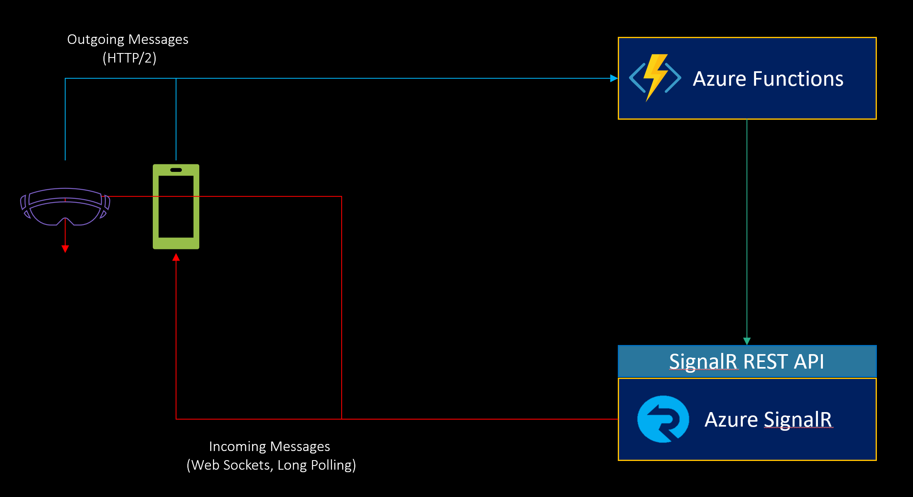
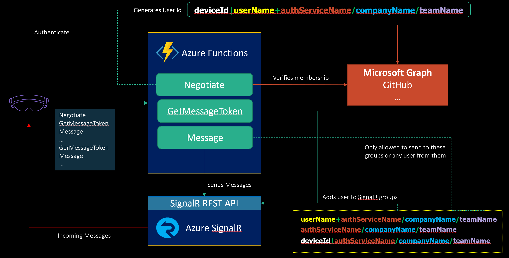

SignalNow Service Architecture
==============================

SignalNow is using “classic” Azure SignalR serverless architecture, with clients
sending messages by calling Azure Functions via HTTP, and receiving via Azure
SignalR (Web Sockets or HTTP Poll).

SignalNow uses 3 Azure Functions for negotiating a connection, getting a message
token, and actually sending messages.

**Negotiate** function (HTTP call) checks if a provided user is a member of a
provided team, then generates a client token for SignalR, and an optional TURN
authentication token.

**GetMessageToken** function generates a JWT token for calling Message function,
then adds the user to a few important SignalR groups.

**Message** is for sending messages. This function checks if current user can
send message to provided receiver. If passes the check, sends provided message.

### **SignalNow ***uses no storage directly***. It maintains permissions using group membership checks on the negotiation stage, and throughout the connection lifetime using user id structure and signed JWT tokens.**

See also

### [SignalNow Azure Functions Detailed Overview](Functions.md)
### [Scaling SignalNow Geographically](Scaling%20SignalNow%20Geographically.md)
