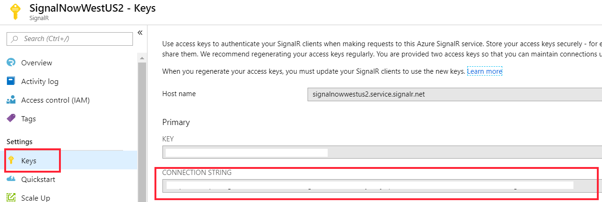
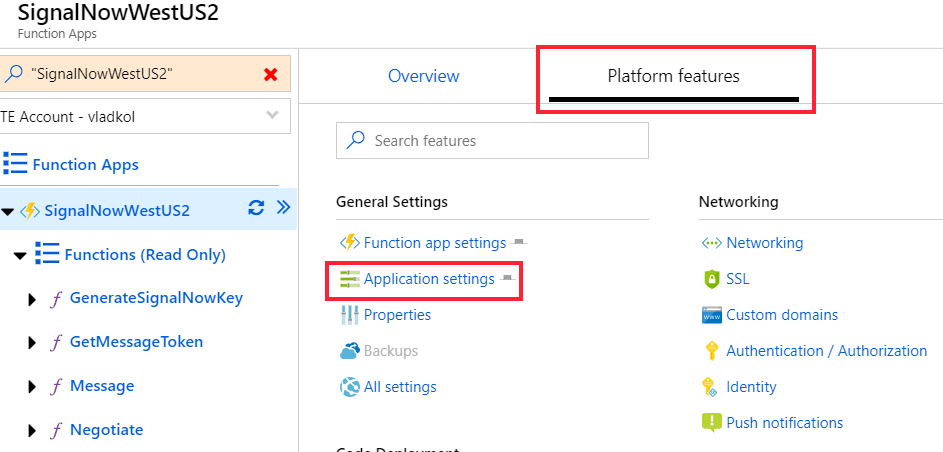
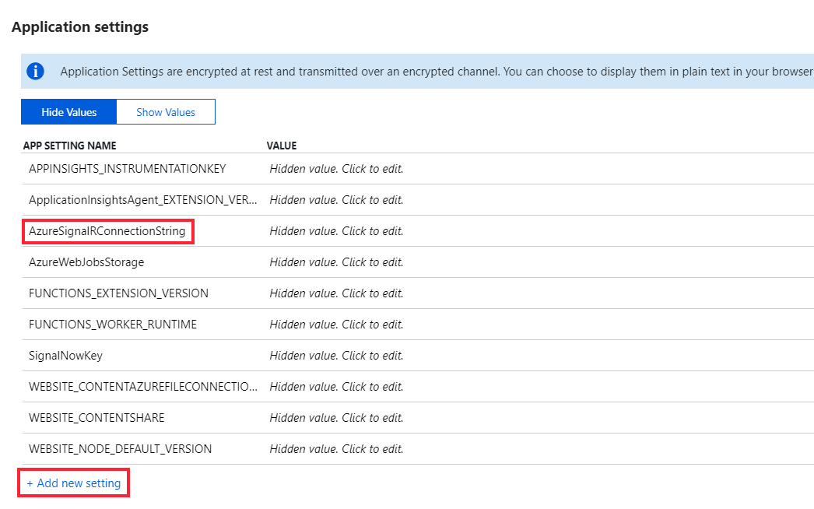

Deployment
===========================================================

You can deploy SignalNow as an Azure Function app and Azure SignalR service using this [**ARM Template**](../Azure/Deployment/asuredeploy.json) (azuredeploy.json in Azure/Deployment folder)

## Deploy to Azure
 

## Manual deployment

If you prefer manual deployment here are the steps:

1.  Create an Azure SignalR service.

2. Copy connection string from **Keys** tab

3.  Create an Azure Function app.

4.  In Application Settings section, create a new setting with name "**AzureSignalRConnectionString**" and value of **Connection String** you copied from SignalR

