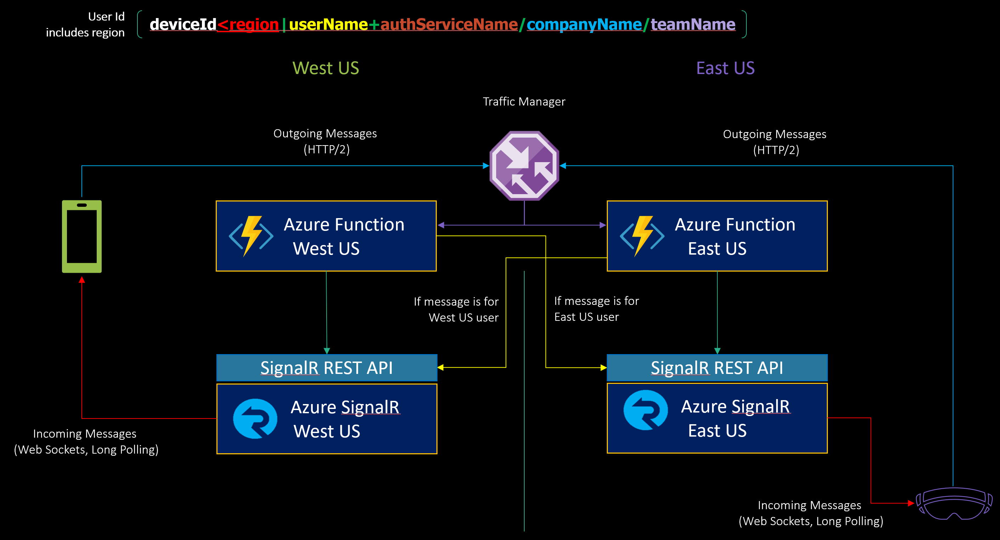

Scaling SignalNow Geographically (TODO)
=======================================

1.  Scale Azure Functions App Service using Traffic Manager.

2.  Add Region property to every User Id
    (**deviceId\<region\|userName+authServiceName/companyName/teamName**)

3.  If message is for user in another region, call SignalR REST API endpoint in
    the *target region* (**here is a hop between Azure Regions**)

4.  If message is for a group, call SignalR REST API *on all* SignalR REST
    endpoints across all regions (asynchronously).

