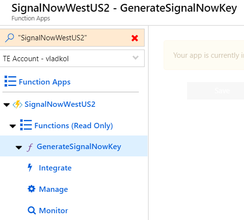
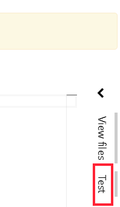
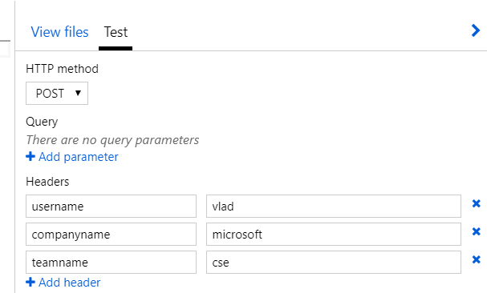
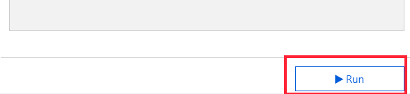
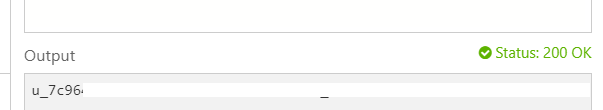

SignalNowKey Authentication (to be deprecated)
===========================================================

A temporary authentication/authorization mechanism based on HMAC-MD5 hashes with
a separate security key.

It includes code of SignalNowKey Graph Service code
(AuthenticateSignalNowKey.cs) and an additional Azure Function.

## GenerateSignalNowKey function (requires Admin authorization level / host key)

Generates a token as an HMAC-MD5 hash of user name, company and team names with
a separate app-wide security key (SignalR access key)

*Function input (all - request headers):*

-   **companyName** - Company name, company id or tenant id, e.g. 'microsoft' or
    '72f988bf-86f1-41af-91ab-2d7cd011db47'.

-   **teamName** - Team name or team id, e.g. 'MyTeam' or
    '11244a09-ff97-4178-9635-4ca38dfb1015'. May also be a 'room name' for
    room-oriented scenarios.

-   **userName** - User name, e.g. 'vlad' or 'vlad\@microsoft.com'

 

The result key is generated as an HMAC-MD5 hash with data of string
'{userName}+signalnow/{companyName}/{teamName}' and SignalR access key
application setting as hash key.

 

*Function output:*

-   SignalNowKey token
 
*You can use this token as authServiceToken parameter of Negotiate function.*

 

**When authenticating with [Negotiate](Serverless%20Signaling.md)** function, the same code is used for generating a SignalNowKey to compare
with.**
 

*How to generate a SignalNowKey token manually.*

1.  Open Function app in the portal.

2.  Select GenerateSignalNowKey function.

3.  Open **Test** tab on the right side of the page

4.  Provide 3 headers

-   username

-   teamname

-   companyname

5.  Scroll down. Click **Run** button.

The result token will be Output window

